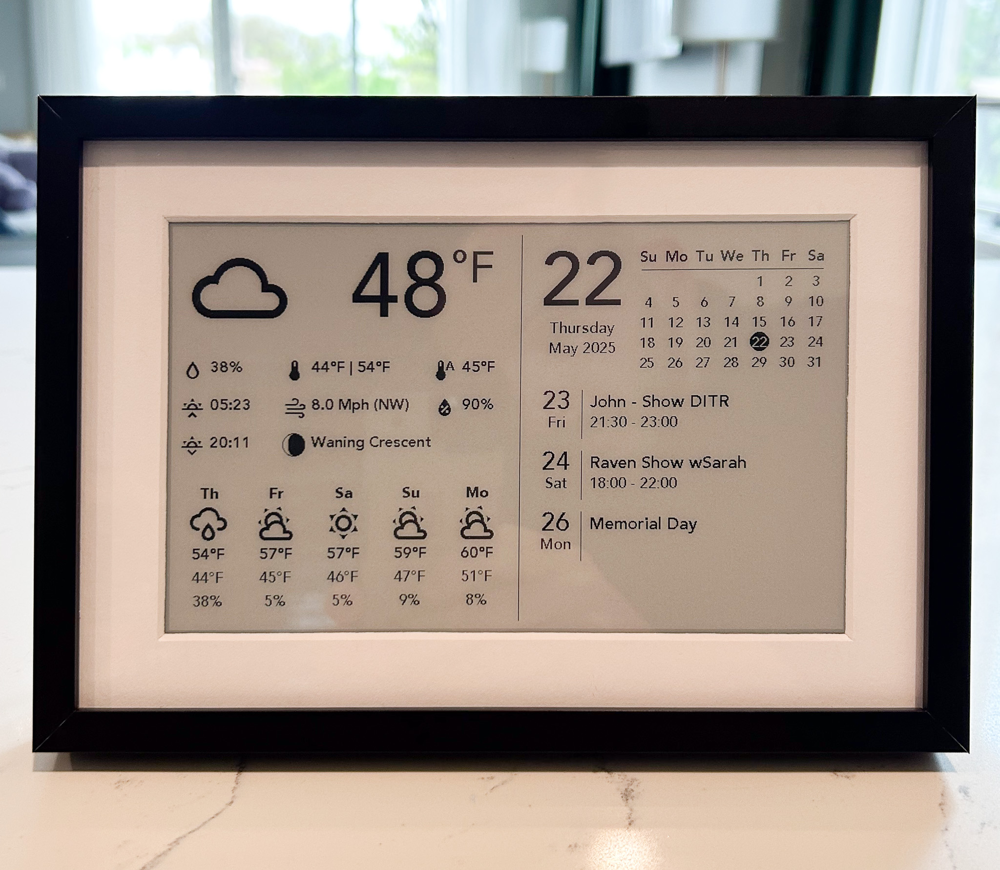

# E-ink Weather and Calendar Display

This is a simple ESPHome based e-ink weather and calendar display project. I used a 7.5" waveshare e-paper display and the waveshare ESP32 universal driver module. I mounted the whole thing in a picture frame and run it off USB power (no battery).



## Project References

The following existing projects/reddit posts were used as reference, source code starting point, and inspiration for this work and are given credit here:

- [Use ESPHome with e-ink Displays to blend in with your home decor!](https://community.home-assistant.io/t/use-esphome-with-e-ink-displays-to-blend-in-with-your-home-decor/435428)
- [esphome-weatherman-dashboard](https://github.com/Madelena/esphome-weatherman-dashboard)
- [epaper-display](https://github.com/jeroen85/epaper-display)
- [ESPHome-ePaper-Calendar](https://github.com/paviro/ESPHome-ePaper-Calendar/tree/main)

## Documentation References

- [ESPHome](https://esphome.io/)
- [ESPHome Waveshare Display Module](https://esphome.io/components/display/waveshare_epaper.html)

## Hardware

The following hardware was used:

- [Waveshare 800×480, 7.5inch E-Ink display HAT for Raspberry Pi](https://www.waveshare.com/product/displays/e-paper/epaper-1/7.5inch-e-paper-hat.htm?___SID=U)
- [Waveshare Universal e-Paper Raw Panel Driver Board, ESP32 WiFi / Bluetooth Wireless](https://www.waveshare.com/product/displays/e-paper/driver-boards/e-paper-esp32-driver-board.htm)
- [Custom Frame and Mat](https://www.frameiteasy.com/)
  - I custom ordered a metal frame with the following dimensions to fit the screen. The frame came with a foam board backing that I cut a small hole in to allow the ribbon cable to pass through. I then literally pressed and drove the header pins of the Waveshare driver board into the foam board to secure it in place on the back of the frame.
    - Matboard: Inner Dimension 6 1/2" x 3 15/16", Outer Dimension 8 1/2" x 5 15/16"
    - Frame: Art Size: 8 1/2" x 5 15/16"
- [Easel](https://www.amazon.com/dp/B0979QFS9Q?th=1) 
  - I used a Fletcher EaselMate to allow the frame to stand on a table

### Hardware Setup

There isn't really any hardware setup. Just connect the screen to the universal display module and plug in USB power (USB-C). To test the display before moving onto ESPHome I downloaded the Arduino example code from Waveshare and ran it just to make sure the display worked: [E-Paper ESP32 Driver Board](https://www.waveshare.com/wiki/E-Paper_ESP32_Driver_Board)

- For the 7.5" display I used I had the A/B resistor switch on the driver board set to "B" per the documentation. 

## Home Assistant Setup

### Integrations

This project uses the following integrations:

- [Sun](https://www.home-assistant.io/integrations/sun)
- [Moon](https://www.home-assistant.io/integrations/moon)
- [The Weather Channel (HACS)](https://github.com/jaydeethree/Home-Assistant-weatherdotcom)
  - You can substitute in whatever weather service you like but this is the configured service in the code as is
- [NWS Alerts (HACS)](https://github.com/finity69x2/nws_alerts)
  - This only works for USA based weather alerts, some other alert provider could be substituted in other locations
- [Google Calendar](https://www.home-assistant.io/integrations/google)
- [ESPHome](https://www.home-assistant.io/integrations/esphome)

#### Integration Notes

- NWS Alerts: Currently the display will only show the first alert for a given region configuration even if there are multiple alerts active. It displays the "Event" field of the alert so that it fits in the limited space on one line. This could be modified to show multiple alerts and/or more detail by modifying the HA_epaper.yaml weather_alert_now and weather_alert_number code.

### Python Script

A python script is used to format the calendar event data. Copy the python_scripts folder and contents provided to your Home Assistant root directory (creating the python_scripts folder at the root level if needed)

### Template Sensors and Configuration

The display makes use of multiple templated sensors and configuration in HA_epaper.yaml. These must be integrated into the Home Assistant configuration.yaml (or custom yaml file).

1. First edit the HA_epaper.yaml file provided under HomeAssistant_sensor folder to customize for your setup
    - The weather service provider should be set to your desired provider. Change all occurrences of "weather.weather_ch" to your weather provider. The project assumes the weather provider provides daily weather forecast data via the weather-get_forecasts call.
2. Edit the calendar entity IDs to your own. These are stored in the secrets.yaml file.

    ```yaml
    entity_id:
                # Add your calendar entity id's here
                - !secret calendar1
                - !secret calendar2
                - !secret calendar3
    ```

3. Integrate/copy the HA_epaper.yaml file into your configuration.yaml file. If a template: section already exists in your file just append the template section from the HA_epaper.yaml.
4. After integrating restart HA
5. You can verify proper operation by checking the "ESP Calendar Data" and "e-paper display data" sensor entities and see that they are populated with data.

## ESPHome Setup

Following the ESPHome guides I installed ESPHome on the driver board using the Windows command line/python version of ESPHome. I did not use the Home Assistant ESPHome device builder but you could.

The project uses a secrets.yaml file which needs to be populated with the following secure credentials provided by your setup and the ESPHome initial base installation on the device Create a secrets.yaml file in the root folder of the project and populate it with the following (filling in the values for your setup):

```
wifi_ssid: 
wifi_password:
ota_password: 
encryption_key: 
fallback_password: 
```

Once installed compile and flash the provided epaper.yaml file to the board.
